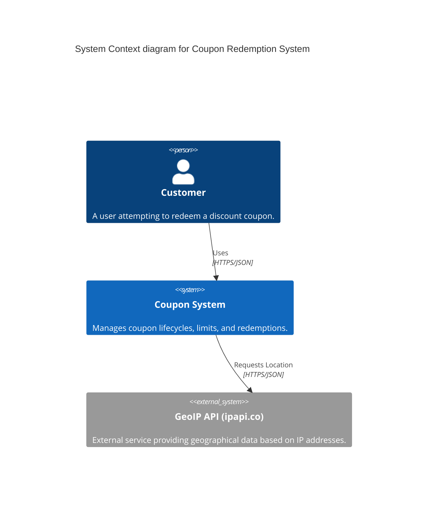
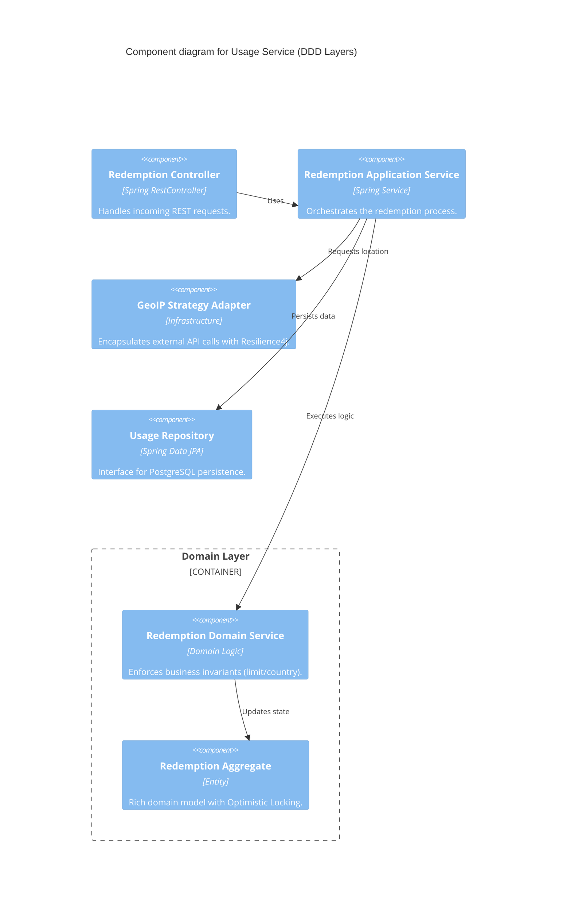

### `ARCHITECTURE.md`

# 🏗️ System Architecture (C4 Model)

This document describes the architectural design of the **Coupon Redemption System** using the C4 model.

---

## 📍 Level 1: System Context
The high-level view of how users interact with the system and its external dependencies.



---

## 📦 Level 2: Container Diagram
This diagram shows the high-level technology choices and how the microservices communicate.

```mermaid
C4Container
    title Container diagram for Coupon Redemption System

    Person(user, "Customer", "User with a coupon code")
    
    System_Boundary(c1, "Coupon System") {
        Container(gateway, "API Gateway", "Spring Cloud Gateway", "Entry point, handles routing and rate limiting.")
        Container(eureka, "Service Discovery", "Netflix Eureka", "Service registration and health monitoring.")
        
        Container(coupon_service, "Coupon Service", "Java/Spring Boot", "Source of truth for coupon definitions and stock.")
        Container(usage_service, "Usage Service", "Java/Spring Boot", "Handles redemption logic and Geo-validation.")
        
        ContainerDb(coupon_db, "Coupon DB", "PostgreSQL", "Stores coupon metadata and limits.")
        ContainerDb(usage_db, "Usage DB", "PostgreSQL", "Stores redemption audit logs and user history.")
        
        ContainerQue(kafka, "Message Broker", "Apache Kafka", "Asynchronous event bus for successful redemptions.")
    }

    System_Ext(geoip, "GeoIP API", "External IP-to-Location provider.")

    Rel(user, gateway, "Sends Request", "HTTPS/JSON")
    Rel(gateway, coupon_service, "Routes to", "HTTP/JSON")
    Rel(gateway, usage_service, "Routes to", "HTTP/JSON")
    
    Rel(usage_service, coupon_service, "Validates Coupon (Feign)", "Synchronous HTTP")
    Rel(usage_service, geoip, "Fetch Location", "REST")
    Rel(usage_service, kafka, "Publish Redemption Event", "Asynchronous")
    
    Rel(coupon_service, coupon_db, "Read/Write", "JDBC")
    Rel(usage_service, usage_db, "Read/Write", "JDBC")
```

---

## 🧩 Level 3: Component Diagram (Usage Service)
Zooming into the **Usage Service** to show the internal **Clean Architecture / DDD** structure.



---

## 🛠️ Key Architectural Patterns Applied

### 1. **Optimistic Locking**
To handle high concurrency, we use `@Version` on the Coupon aggregate.
* **Why?** Instead of heavy database locks (Pessimistic), we allow concurrent reads and only fail at the commit stage if another thread updated the coupon limit first. This significantly increases throughput.

### 2. **Strategy Pattern (Geo-Location)**
The `GeoLocationProvider` is an interface with multiple implementations (e.g., `IpApiProvider`, `MockProvider`).
* **Why?** It decouples the business logic from the external API. During local development or testing, we can swap the real API for a mock without changing the service code.

### 3. **Circuit Breaker (Resilience4j)**
The call to the external GeoIP service is wrapped in a Circuit Breaker.
* **Why?** If the external service is slow or down, the system "trips" the circuit and fails fast (returning a `422 Try Later` error) instead of hanging threads and causing a system-wide crash.

### 4. **Microservices Isolation**
Each service has its own schema in PostgreSQL.
* **Why?** This prevents "hidden coupling" via the database. Changes to the `coupon_service` schema won't break the `usage_service`.

